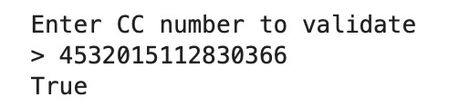
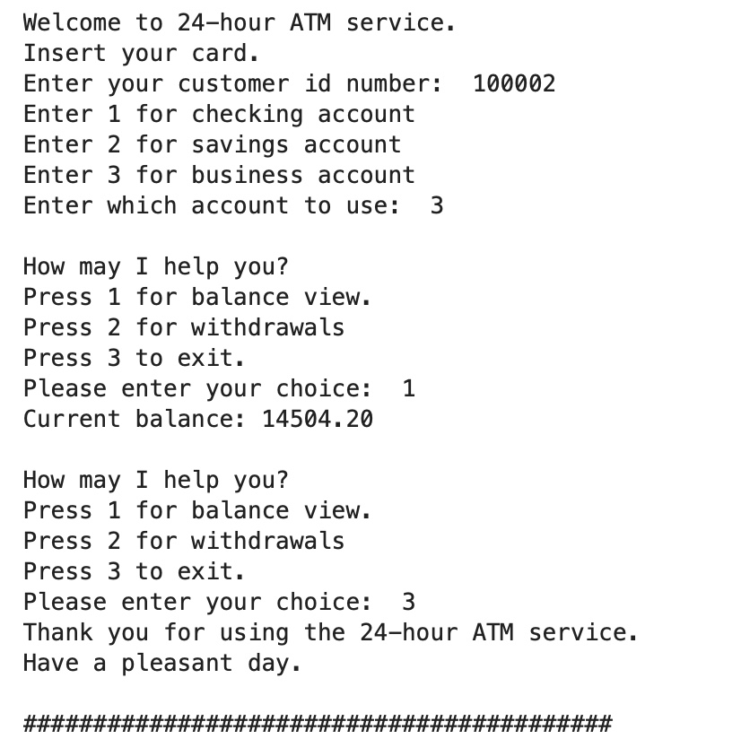
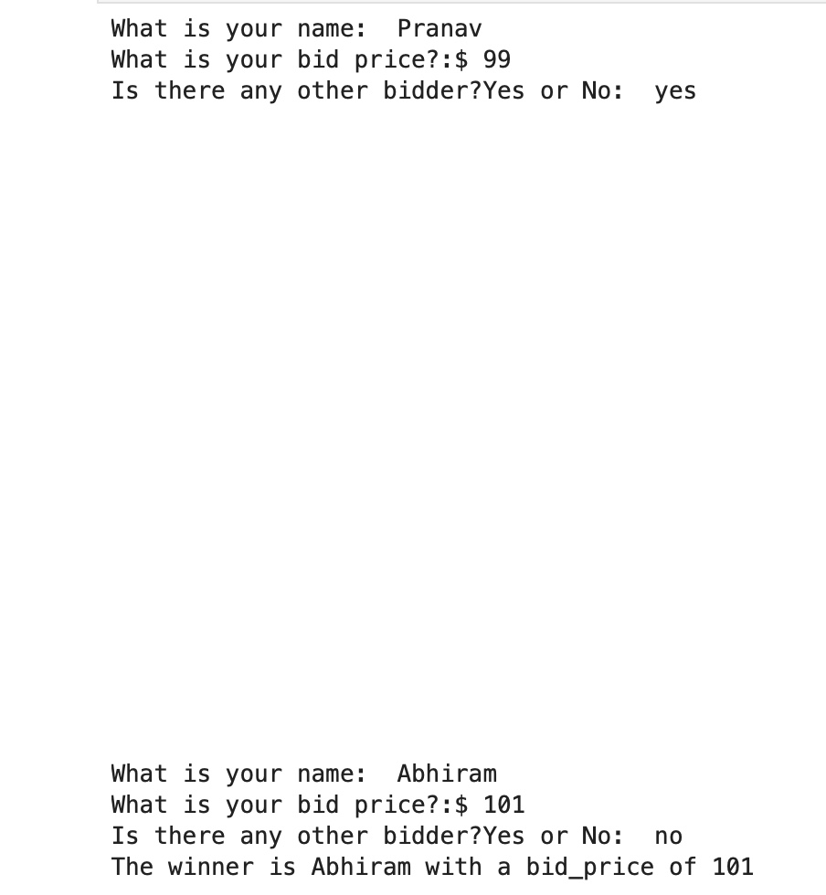

# PyProjects
Hey!This is a portfolio for my python coding projects

### [Project_1:Credit_card-validator](https://github.com/PRANAVKUMAR183/Credit_card-validator) (Link to project)

*This tool is designed to validate credit card numbers. It ensures the validity of a credit card number by employing a checksum algorithm known as the Luhn algorithm. This algorithm checks the sum of the digits in the card number to verify if it meets the criteria for a valid credit card.

**Outcome**:

### [Project_2:Bank_Ac_Manager](https://github.com/PRANAVKUMAR183/Bank_Ac_Manager) (Link to project)

*This is a Python application that uses an abstract class to represent various bank account types and is structured like an ATM. Every type of account will implement different methods for managing credits and debits and inherit from the Account abstract class.

**Outcome**:

### [Project_3:Black_Jack](https://github.com/PRANAVKUMAR183/Black_Jack) (Link to project)

*The game prompts players to get as close to 21 as possible without exceeding it. In this round, the player stood at 21 with a Queen and Ace, while the dealer reached 19. The player won the hand, increasing their winnings to 120 chips.

**Outcome**:

### [Project_4:Auction_Bid_Price](https://github.com/PRANAVKUMAR183/Auction_Bid_Price/tree/main) (Link to project)

*A blind action, deciding the winner with the highest bid.

**Outcome**:

